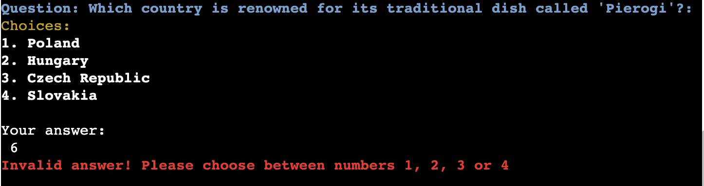

# [WORLD FOODIE](https://world-foodie-45620940cdb2.herokuapp.com)


-------------------------------------

## Introduction

- Welcome to World Foodie Quiz, an interactive and engaging quiz designed for food enthusiasts and curious minds alike. This quiz challenges players to test their knowledge of traditional dishes from around the globe. With each question, you'll be transported to different regions, from the vibrant streets of Vietnam to the rustic kitchens of Greece, while learning about some of the world's most beloved dishes.

- The goal of World Foodie Quiz is simple: to educate and entertain users through a fun, interactive experience. Whether you're a seasoned foodie or someone eager to expand your culinary horizons, this quiz will not only test your knowledge but also introduce you to new and exciting flavors from all over the world.

- It’s perfect for anyone looking to challenge their understanding of international cuisine or simply pass the time in a fun and educational way. It's perfect for students, travelers, and food lovers alike, the World Foodie Quiz aims to foster a deeper appreciation for the rich variety of dishes that represent cultures from every corner of the globe - in a fun and a rather informal way.

--------------------------------------

## Features

- **Interactive Questionnaire:** The quiz asks a series of food-related questions about traditional dishes from different countries. This feature is designed to engage users who enjoy learning about global cuisines while testing their knowledge in a fun and interactive format.

- **Input validation** for user answers: Only allows valid answers ("1", "2", "3" or "4" and "yes" or "no"). Any input outside this range triggers an error message, asking the user to re-enter their answer, which ensures smooth interaction without confusion.



- **Randomized Question Order:** Each time the quiz is played, the order of the questions is shuffled, ensuring a unique experience with every attempt. This feature enhances user engagement by keeping the quiz fresh and challenging.


- **Score Calculation:** After completing the quiz, users receive a score based on the number of correct answers. The feedback message adjusts based on their score, motivating them to continue exploring world cuisines.


- **Personalized Feedback Messages:** Based on the user's score, the quiz provides personalized feedback ranging from "explore more" to "congratulations." This keeps the user engaged and motivated to try again.


- **Replay Functionality:** At the end of the quiz, users are given the option to restart and retake the quiz. This feature encourages users to improve their score or simply enjoy another round of learning.


-----------------------

### Future Features

- **Leader board or High Score Feature:** Implement a leader board that shows the top scores. This would add a competitive aspect to the quiz, encouraging users to try again, improve their scores and invite more users to join in and compete.

- **Add a Timer for Each Question:** Introduce a countdown timer for each question, where the user must answer before the time runs out. This would make the quiz more engaging and adds another layer of difficulty.

- **Allow Users to Review Correct/Incorrect Answers:** After finishing the quiz, give users the option to review which questions they got wrong, in order to learn from the quiz as well.

------------------------------------

## Tools & Technologies Used


- [](https://tim.2bn.dev/markdown-builder) used to generate README template.
- [](https://git-scm.com) used for version control. (`git add`, `git commit`, `git push`)
- [](https://github.com) used for secure online code storage.
- [](https://code.visualstudio.com) used as my local IDE for development.
- [](https://www.python.org) used as the back-end programming language.
- [](https://pages.github.com) used for hosting the deployed front-end site.
- [](https://www.heroku.com) used for hosting the deployed back-end site.
- [](https://chat.openai.com) used to help debug, troubleshoot, and explain things.

### Other tools and technologies

- [Unittest](https://docs.python.org/3/library/unittest.html)Python library used to test the different features applied in this quiz.
- [Unittest Mock](https://docs.python.org/3/library/unittest.mock.html) Used for simulating and testing the behavior of each feature
- [Colorama](https://pypi.org/project/colorama/) Library used to color and style the quiz in terminal

-------------------------------

## Data Model

### Tuples

+ The project primarily uses tuples to store the quiz questions, multiple choices, and correct answers. Tuples are ideal in this case because they are immutable, which makes sure that the quiz data doesn't accidentally get altered during the quiz process.

    + **food_questions:** Stores the quiz questions in a tuple. Each element corresponds to a question.
        
        ```python
            food_questions = (
                "Which country is famous for its traditional dish of 'Pho'?: ",
                "What is the main ingredient in the indian dish 'Samosa'?: ",
                "What food is Peru known for?",
                ...
            )
        ```
    
    + **mult_choices:** Stores multiple-choice answers for each question. Each inner tuple corresponds to the available choices for one question.

        ```python
            mult_choices = (
                ("1. Japan", "2. Vietnam", "3. Thailand", "4. China"),
                ("1. Rice", "2. Potatoes", "3. Noodles", "4. Tofu"),
                ("1. Sushi", "2. Tacos", "3. Ceviche", "4. Hamburger"),
                ...
            )
        ```
    
    + **correct_answer:** Stores the correct answers in the form of the corresponding number string. Each element corresponds to the correct answer for one question in the quiz.

        ```python
            correct_answer = ("2", "2", "3", "1", "1", "4", "1", "1", "2", "1")
        ```

### Functions

- The program depends on functions in order to conduct the quiz. Below are the key functions:
    
    - **conduct_quiz(food_questions, mult_choices, correct_answer):**
        - This core function handles the entire quiz flow of presenting the questions, multiple choices, the users input and finally calculating the score of the users input.
    
    - Key logic within **conduct_quiz:**
        - Input validation: Ensures that user answers are valid by checking if the input is within the allowed range ("1" to "4"). Important to add that it's also insured in the last question of restarting quiz (input: "Yes"/"no").
        - Shuffling of questions: Uses the random.shuffle() function to randomize the order of questions each time the quiz runs.
        - Scoring: Uses a loop and the zip() function to compare the user's answers to the correct answers and calculate the final score.


### Imports

I've used the following Python packages and/or external imported packages.

- `colorama`: Used to add color and formatting to the terminal output, making the quiz more visually appealing for     the user.
- `random`: Used to shuffle the quiz questions to provide a random order each time the quiz runs.

## Testing

### Manual testing

- **Input validation**
    - Manual testing involved running the quiz and entering specific sets of invalid inputs to verify that the program handled them correctly. The inputs tested included letters, multiple letters, numbers outside the valid range, an empty input (ENTER), only spaces, and special characters. As shown in the image below, the program responded to each of these cases as expected, rejecting invalid entries and prompting the user to input a valid answer.

    

- **Question randomization** successfully shuffles the order of questions in each quiz session. By restarting the quiz, it was proven the question presented in random order. Please refer to image in feature section in the beginning. 

- 

> [!NOTE]  
> For further extensive testing, please refer to the [unittest.mock](quiztesting.py) file.

### Python validator

- The Code Institute's own [PythonLinter](https://pep8ci.herokuapp.com/) was used to validate the code created for this quiz. Mistakes that were corrected were the common ones such as: 
    - W291 trailing whitespace
    - W293 blank line contains whitespace
    - E122 continuation line missing indentation or out-dented
    - E501 line too long (124 > 79 characters)
These were all amended by following the suggestions. Unfortunately this was not documented. For future improvements documentation of each step will be made.


## Deployment

Code Institute has provided a [template](https://github.com/Code-Institute-Org/python-essentials-template) to display the terminal view of this backend application in a modern web browser.
This is to improve the accessibility of the project to others.

The live deployed application can be found deployed on [Heroku](https://world-foodie-45620940cdb2.herokuapp.com).

### Heroku Deployment

This project uses [Heroku](https://www.heroku.com), a platform as a service (PaaS) that enables developers to build, run, and operate applications entirely in the cloud.

Deployment steps are as follows, after account setup:

- Select **New** in the top-right corner of your Heroku Dashboard, and select **Create new app** from the dropdown menu.
- Your app name must be unique, and then choose a region closest to you (EU or USA), and finally, select **Create App**.
- From the new app **Settings**, click **Reveal Config Vars**, and set the value of KEY to `PORT`, and the value to `8000` then select *add*.
- If using any confidential credentials, such as CREDS.JSON, then these should be pasted in the Config Variables as well.
- Further down, to support dependencies, select **Add Buildpack**.
- The order of the buildpacks is important, select `Python` first, then `Node.js` second. (if they are not in this order, you can drag them to rearrange them)

Heroku needs three additional files in order to deploy properly.

- requirements.txt
- Procfile
- runtime.txt

You can install this project's **requirements** (where applicable) using:

- `pip3 install -r requirements.txt`

If you have your own packages that have been installed, then the requirements file needs updated using:

- `pip3 freeze --local > requirements.txt`

The **Procfile** can be created with the following command:

- `echo web: node index.js > Procfile`

The **runtime.txt** file needs to know which Python version you're using:
1. type: `python3 --version` in the terminal.
2. in the **runtime.txt** file, add your Python version:
	- `python-3.9.19`

For Heroku deployment, follow these steps to connect your own GitHub repository to the newly created app:

Either:

- Select **Automatic Deployment** from the Heroku app.

Or:

- In the Terminal/CLI, connect to Heroku using this command: `heroku login -i`
- Set the remote for Heroku: `heroku git:remote -a app_name` (replace *app_name* with your app name)
- After performing the standard Git `add`, `commit`, and `push` to GitHub, you can now type:
	- `git push heroku main`

The frontend terminal should now be connected and deployed to Heroku!

### Local Deployment

This project can be cloned or forked in order to make a local copy on your own system.

For either method, you will need to install any applicable packages found within the *requirements.txt* file.

- `pip3 install -r requirements.txt`.

If using any confidential credentials, such as `CREDS.json` or `env.py` data, these will need to be manually added to your own newly created project as well.

#### Cloning

You can clone the repository by following these steps:

1. Go to the [GitHub repository](https://github.com/Naomib2211/world_foodie) 
2. Locate the Code button above the list of files and click it 
3. Select if you prefer to clone using HTTPS, SSH, or GitHub CLI and click the copy button to copy the URL to your clipboard
4. Open Git Bash or Terminal
5. Change the current working directory to the one where you want the cloned directory
6. In your IDE Terminal, type the following command to clone my repository:
	- `git clone https://github.com/Naomib2211/world_foodie.git`
7. Press Enter to create your local clone.

Alternatively, if using Gitpod, you can click below to create your own workspace using this repository.

[](https://gitpod.io/#https://github.com/Naomib2211/world_foodie)

Please note that in order to directly open the project in Gitpod, you need to have the browser extension installed.
A tutorial on how to do that can be found [here](https://www.gitpod.io/docs/configure/user-settings/browser-extension).

#### Forking

By forking the GitHub Repository, we make a copy of the original repository on our GitHub account to view and/or make changes without affecting the original owner's repository.
You can fork this repository by using the following steps:

1. Log in to GitHub and locate the [GitHub Repository](https://github.com/Naomib2211/world_foodie)
2. At the top of the Repository (not top of page) just above the "Settings" Button on the menu, locate the "Fork" Button.
3. Once clicked, you should now have a copy of the original repository in your own GitHub account!

### Local VS Deployment

🛑🛑🛑🛑🛑🛑🛑🛑🛑🛑-START OF NOTES (to be deleted)

Use this space to discuss any differences between the local version you've developed, and the live deployment site on Heroku.

🛑🛑🛑🛑🛑🛑🛑🛑🛑🛑-END OF NOTES (to be deleted)

## Credits

🛑🛑🛑🛑🛑🛑🛑🛑🛑🛑-START OF NOTES (to be deleted)

In this section you need to reference where you got your content, media, and extra help from.
It is common practice to use code from other repositories and tutorials,
however, it is important to be very specific about these sources to avoid plagiarism.

🛑🛑🛑🛑🛑🛑🛑🛑🛑🛑-END OF NOTES (to be deleted)

### Content

🛑🛑🛑🛑🛑🛑🛑🛑🛑🛑-START OF NOTES (to be deleted)

Use this space to provide attribution links to any borrowed code snippets, elements, or resources.
A few examples have been provided below to give you some ideas.

Ideally, you should provide an actual link to every resource used, not just a generic link to the main site!

⚠️⚠️ EXAMPLE LINKS - REPLACE WITH YOUR OWN ⚠️⚠️

🛑🛑🛑🛑🛑🛑🛑🛑🛑🛑-END OF NOTES (to be deleted)

| Source | Location | Notes |
| --- | --- | --- |
| [Markdown Builder](https://tim.2bn.dev/markdown-builder) | README and TESTING | tool to help generate the Markdown files |
| [Chris Beams](https://chris.beams.io/posts/git-commit) | version control | "How to Write a Git Commit Message" |
| [W3Schools](https://www.w3schools.com/howto/howto_js_topnav_responsive.asp) | entire site | responsive HTML/CSS/JS navbar |
| [W3Schools](https://www.w3schools.com/howto/howto_css_modals.asp) | contact page | interactive pop-up (modal) |
| [W3Schools](https://www.w3schools.com/css/css3_variables.asp) | entire site | how to use CSS :root variables |
| [Flexbox Froggy](https://flexboxfroggy.com/) | entire site | modern responsive layouts |
| [Grid Garden](https://cssgridgarden.com) | entire site | modern responsive layouts |
| [StackOverflow](https://stackoverflow.com/a/2450976) | quiz page | Fisher-Yates/Knuth shuffle in JS |
| [YouTube](https://www.youtube.com/watch?v=YL1F4dCUlLc) | leaderboard | using `localStorage()` in JS for high scores |
| [YouTube](https://www.youtube.com/watch?v=u51Zjlnui4Y) | PP3 terminal | tutorial for adding color to the Python terminal |
| [strftime](https://strftime.org) | CRUD functionality | helpful tool to format date/time from string |
| [WhiteNoise](http://whitenoise.evans.io) | entire site | hosting static files on Heroku temporarily |

### Media

🛑🛑🛑🛑🛑🛑🛑🛑🛑🛑-START OF NOTES (to be deleted)

Use this space to provide attribution links to any images, videos, or audio files borrowed from online.
A few examples have been provided below to give you some ideas.

If you're the owner (or a close acquaintance) of all media files, then make sure to specify this.
Let the assessors know that you have explicit rights to use the media files within your project.

Ideally, you should provide an actual link to every media file used, not just a generic link to the main site!
The list below is by no means exhaustive. Within the Code Institute Slack community, you can find more "free media" links
by sending yourself the following command: `!freemedia`.

⚠️⚠️ EXAMPLE LINKS - REPLACE WITH YOUR OWN ⚠️⚠️

🛑🛑🛑🛑🛑🛑🛑🛑🛑🛑-END OF NOTES (to be deleted)

| Source | Location | Type | Notes |
| --- | --- | --- | --- |
| [Pexels](https://www.pexels.com) | entire site | image | favicon on all pages |
| [Lorem Picsum](https://picsum.photos) | home page | image | hero image background |
| [Unsplash](https://unsplash.com) | product page | image | sample of fake products |
| [Pixabay](https://pixabay.com) | gallery page | image | group of photos for gallery |
| [Wallhere](https://wallhere.com) | footer | image | background wallpaper image in the footer |
| [This Person Does Not Exist](https://thispersondoesnotexist.com) | testimonials | image | headshots of fake testimonial images |
| [Audio Micro](https://www.audiomicro.com/free-sound-effects) | game page | audio | free audio files to generate the game sounds |
| [Videvo](https://www.videvo.net/) | home page | video | background video on the hero section |
| [TinyPNG](https://tinypng.com) | entire site | image | tool for image compression |

### Acknowledgements

🛑🛑🛑🛑🛑🛑🛑🛑🛑🛑-START OF NOTES (to be deleted)

Use this space to provide attribution to any supports that helped, encouraged, or supported you throughout the development stages of this project.
A few examples have been provided below to give you some ideas.

⚠️⚠️ EXAMPLES ONLY - REPLACE WITH YOUR OWN ⚠️⚠️

🛑🛑🛑🛑🛑🛑🛑🛑🛑🛑-END OF NOTES (to be deleted)

- I would like to thank my Code Institute mentor, [Tim Nelson](https://github.com/TravelTimN) for his support throughout the development of this project.
- I would like to thank the [Code Institute](https://codeinstitute.net) tutor team for their assistance with troubleshooting and debugging some project issues.
- I would like to thank the [Code Institute Slack community](https://code-institute-room.slack.com) for the moral support; it kept me going during periods of self doubt and impostor syndrome.
- I would like to thank my partner (John/Jane), for believing in me, and allowing me to make this transition into software development.
- I would like to thank my employer, for supporting me in my career development change towards becoming a software developer.

